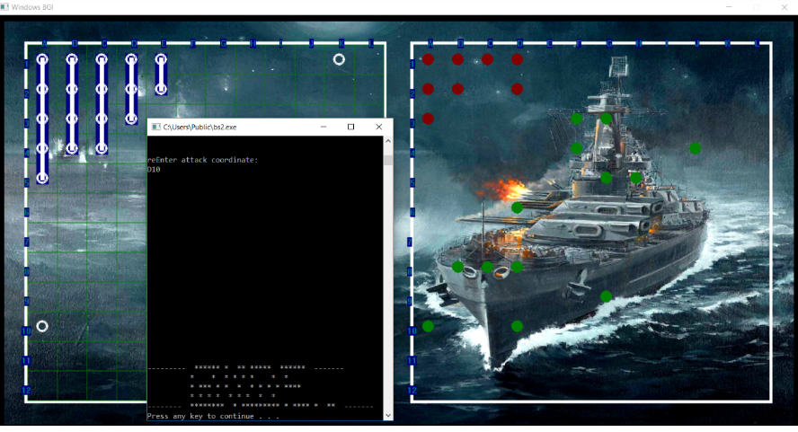
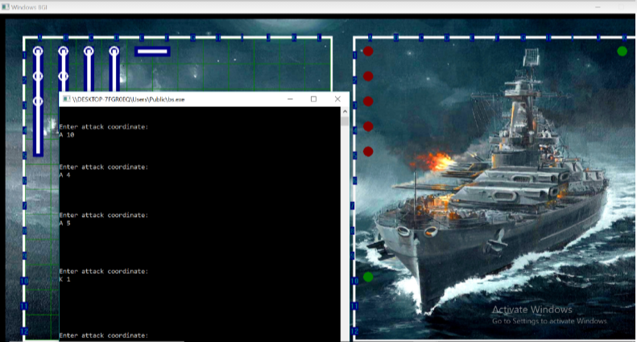

# Battleships-Two-Player-Game

Battleships is a two player game where each player guesses the location of five ships that their opponent has hidden on a grid. The players takes turns typing out a coordinate attempting to guess the coordinates of the enemy ships. Hence, sinking all of the enemy ships by correctly guessing their locations.

This project used C++ graphics, file handling and shared files and object oriented programming.

OUTPUT

